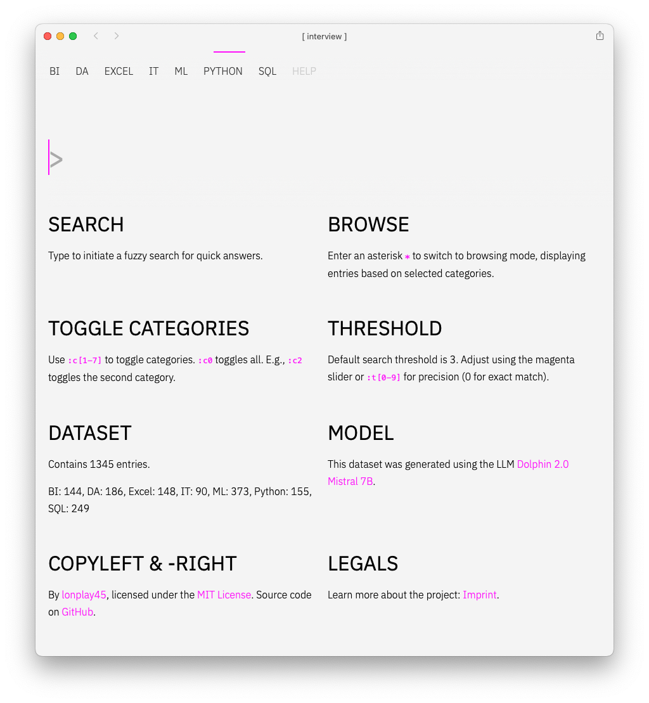

# [ INTERVIEW ] - Real-time Knowledgebase

**INTERVIEW** is an innovative prototype of a real-time knowledgebase interface, designed for fast and intuitive access to complex information resources.

## Beta preview

<https://interview.dev.lp45.net>

## Screenshots





## Languages and helpers

- [node.js](https://nodejs.org/en) v20
- [fuse.js](https://www.fusejs.io) 6.6.2
- [parcel](https://en.parceljs.org/getting_started.html) 2.9.3
- [sass](https://sass-lang.com) 1.63.6
- [typescript](https://www.typescriptlang.org)  5.1.6


## Development & build

Having `node.js` installed...

```bash
# clone source code
git clone https://github.com/netzwerkerei/interview.git
cd interview

# development

# overview
npm run

# frontend
npm run frontend:dev
npm run frontend:build    

# deployment
npm run deploy
```

## Serving your own data

Just create a data.json file with the following schema:

```json
[
    {
        "id": ID,
        "category": CATEGORY_NAME,
        "title": ENTRY_TITLE,
        "content": ENTRY_CONTENT
    },
    ...
]
```

## License

Copyleft /-right hello@lp45.net 2023.
