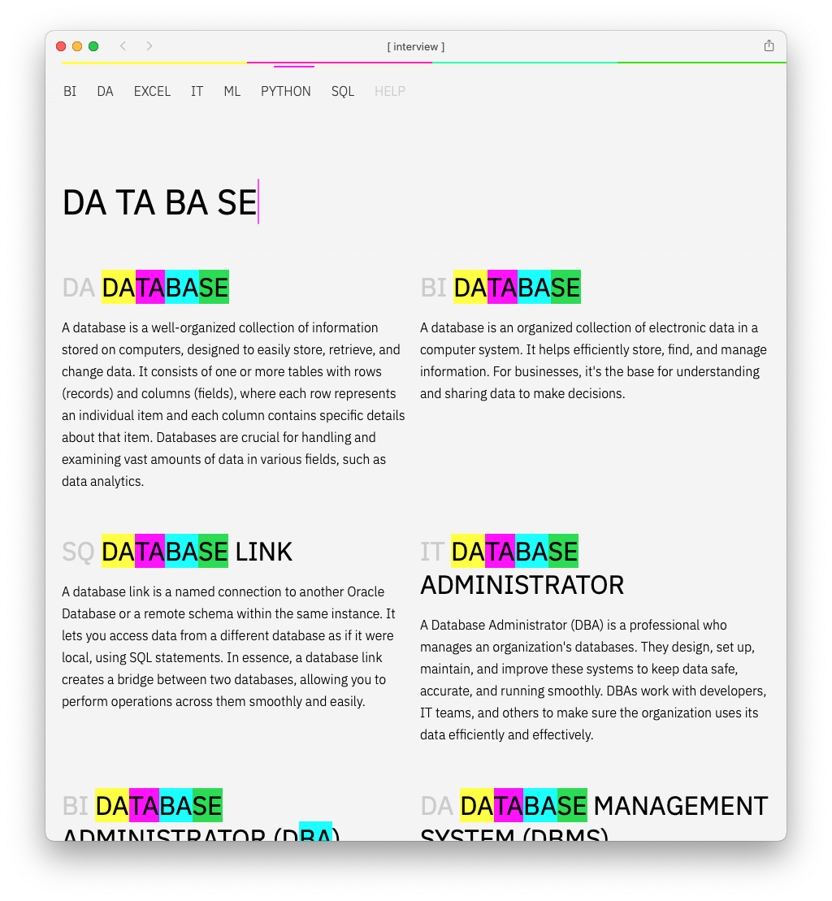
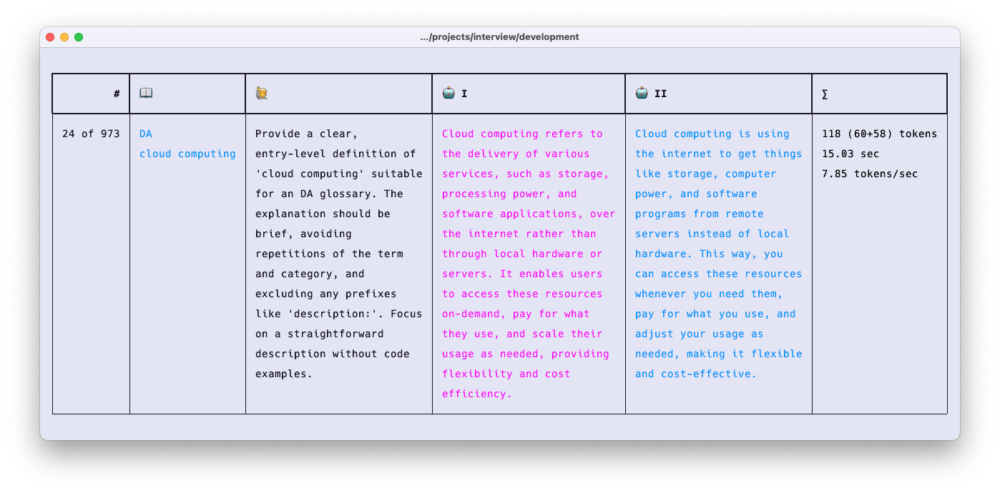

# [ INTERVIEW ] - Real-time Knowledgebase

**INTERVIEW** is an innovative prototype of a _real-time_ knowledgebase interface, created for quick and intuitive access to complex information resources. This dataset was automaticly created using the [Dolphin 2.0 Mistral 7B](https://huggingface.co/TheBloke/dolphin-2.0-mistral-7B-GGUF) model covering data analytics, engineering, and science, along with categories such as BI, DA, Excel, IT, ML, Python, and SQL.

## Preview

[https://interview.dev.lp45.net](https://interview.dev.lp45.net)

## Screenshots





## Shortcuts

|Key sequence|Effect|
|-|-|
|:h|Display help|
|*|Browser whole dataset|
|:t0|Set fuzzy search threshold between 0 and 9, where 0 is an exact match|
|:c0|Toggle all categories on/off|
|:c[n]|toggle single categorie on/off. Replace [n] with category-nr. counting from left to right. So :c3 whould toggle the third category in your dataset from the right.|

## Dataset



This dataset was generated using the [Dolphin 2.0 Mistral 7B](https://huggingface.co/TheBloke/dolphin-2.0-mistral-7B-GGUF) model.

Last updated: 2024-02-01

## Languages and helpers

- [node.js](https://nodejs.org/en)
- [fuse.js](https://www.fusejs.io)
- [parcel](https://en.parceljs.org/getting_started.html)
- [sass](https://sass-lang.com)
- [typescript](https://www.typescriptlang.org)


## Development & build

Having `node.js` installed...

```bash
# clone source code
git clone https://github.com/netzwerkerei/interview.git
cd interview
npm i

# development

# overview
npm run

# frontend
npm run development
npm run frontend:build    

# deployment
npm run deploy
```

## Serving your own data

Just create a data.json file with the following schema:

```json
[
    {
        "id": ID,
        "category": CATEGORY_NAME,
        "title": ENTRY_TITLE,
        "content": ENTRY_CONTENT
    },
    ...
]
```

## License

Copyleft /-right hello@lp45.net 2024.
